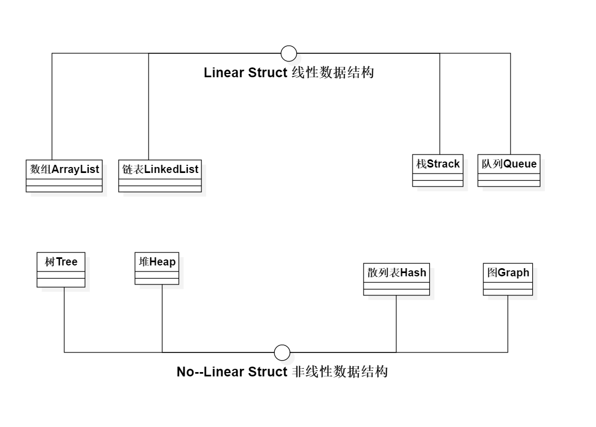
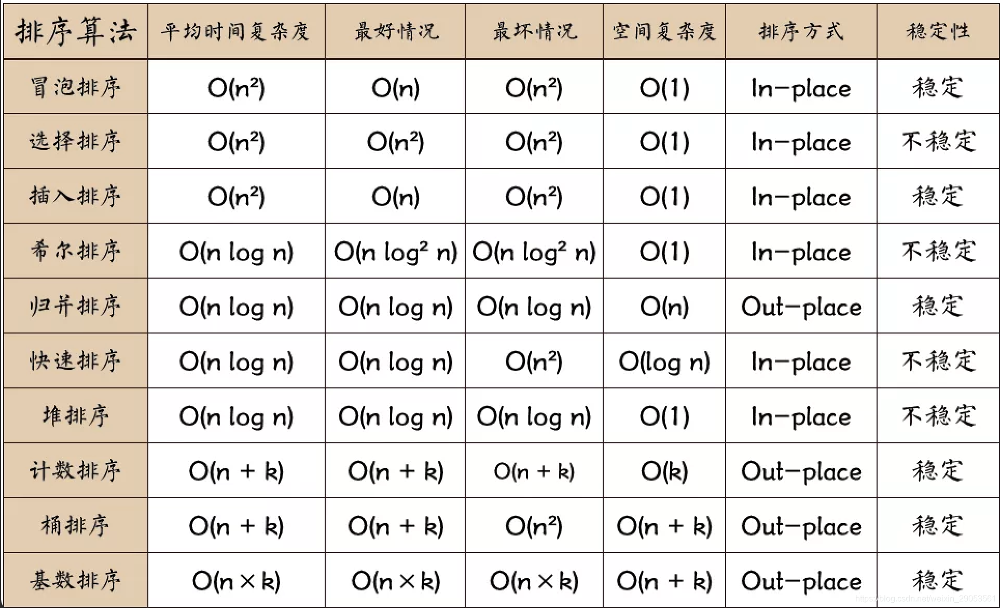

# 数据结构(C/java) 
#数据结构与语言无关，但是C语言概念定义是最基础定义，以下Java则是另一种语言实现方式
## 第一章-什么是数据结构?((C/Java) data structure)
1. 数据结构就是研究数据的逻辑结构，存储结构和运算方法的学科
2. 数据的逻辑结构包括:集合,线性结构，树形结构，图形结构
3. 线性结构指的是一对一的关系，树形结构存在一对多的关系，图形结构存在多对多的关系，存在一对多和多对多关系的又称为非线性结构
4. 数据结构的存储结构:顺序存储(ArrayList)，链式存储(LinkedList)，索引存储(B-Tree和自定义索引)，散列存储(hasCode)
5. 算法的效率通常用时间复杂度和空间复杂度来评价，这两者的越好，则算法的效率越高
6. 时间复杂度是指包含简单操作次数的多少，T(n)=O(n?)；空间复杂度从开始到结束所需要的存储空间,S(n)=O(f(n))

## 第二章-线性表(Linear List)
1. 线性表是一种线性数据结构，元素存在"一对一的关系",线性表的每个数据元素的类型都是相同的.
2. 线性表又分为线性存储和链式存储,一维数组和线性链表.
3. Java和C的一维数组表示相同，增插改删的操作相同,线性链表在Java语言中有单双向(循环链表),C是头指针和头节点(也可以自定义双向(循环)链表)
4. Java的链表操主要是双向链表，带prev(头节点)和next(尾节点),增插改删断裂和C语言大致相同，首尾节点断裂组合新的链表.
5. ArrayList查询方便和存储比较节约,但是插入和删除的操作需要移动大量的数据，LinkedList扩充容易，插入删除方便，但是存储空间浪费.
## 第三章-栈(Stack)
1. 栈是限制在表尾进行插入和删除的线性表,特性是先进后出,主要应用在铁路和存放桶.
2. C语言中又分顺序栈和链栈,顺序栈是一维数组+栈顶指针=-1,栈顶指针值=元素位置.链栈为栈顶指针指向一个单链表.
3. Java语言的栈用双链表表示,不过插入时候后插入的节点作为头节点，而先插入的节点作为"尾节点"，即setNext(head).
## 第四章-队列(Single Queue and double-ends queue)
1. 队列(Single Queue)是限制在表的两端进行操作的线性表,主要特点是"先进先出".队首部允许删除，队尾允许插入.
2. C语言中队列又分为顺序队列(循环队列)和链式队列,顺序队列用一维数组和首尾指针=-1来表示，进队尾指针+1，出队头指针+1，元素位置=尾指针-头指针.循环队列将[0]与[MAXLEN-1]看作首尾相连的环，形成一个环形表，需要格外判断"队空"和"队满".链式队列是头尾指针独立的两个指针变量，头指针指向单链表的头节点，而尾指针指向单链表的尾节点.
3. Java语言中队列可以用双链表操作，先进先出的特性是tail.setNext(newNode);newNode.setPrev(tail);
4. C语言中的双队列可以在队首和队尾进行存取数据，Java语言的双向队列可以多应用在并发阻塞队列(理解水平一般).
## 第五章-串(string)
1. 串是零个或多个任意字符组成的有限队列.
2. 串也分顺序存储和链式存储,Java中有字符串类型String类
## 第六章-多位数组和广义表(generalized lists)
1. 多维数组需要线性代数的分析
2. 广义表的元素为原子项，即不可再被分割，表中的元素既可以是单个元素也可以是一个子表
3. 这一章大多和矩阵有关，类似转置和找规律的题.
## 第七章-树和二叉树(Tree)
1. 树是n(n>=0)个有限数据结合,树有三种表示方法:嵌套集合法,圆括号表示法，凹入表示法
2. 树的基本术语不再累述 
3. 二叉树是是"有序树"最特殊也是最重要的树,二叉树是有n(n>=0)个节点的有限集合.
4. 二叉树的性质:①一颗非空二叉树的第i曾最后有2的i-1次方的个的结点(i>=1)②深度为h的二叉树，最多具有2的h次方-1个结点(h>=1)③一棵树的深度为h,具有2的h次方-1的的二叉树为满二叉树(所有结点的位置都占满,终端结点这里不算入结点).
5. 完全二叉树除最后一层外都是满的，其余各层都是满的，并且最后一层或者为满,或者仅右边缺少若干个连续结点.
6. C语言中的二叉树分为顺序存储和链式存储，顺序存储用一维数组，当二叉树为满二叉树或完全二叉树的时，采用一维数组可以节省存储空间.链式存储分为二叉链表存储和三叉链表存储(多一个指向父节点的指针).
7. Java语言中二叉树的底层实现用的是二叉链表存储,左右子节点指向子结点的数据域.
8. 先根遍历(DLR),中根遍历(LDR),后序遍历(LRD),均可以采用递归的方式寻找左右子树，而层次遍历则可以使用队列+一维数组来操作，每次出队的元素会断定自己的左右孩子结点是否为空，再进行入队操作,一直循环直到队列为空.
9. 二叉的叶子(终端结点)，左右子树均为空,count++,递归求出叶子结点.二叉树的结点的左右子树不为空就count++.二叉树的深度即递归左右子树的各自深度，两者相比的最大的深度+1是二叉树的深度.
## 第八章-图的定义和基本操作(Vertex)
1. 图是有非空的顶点(vertices)集合和描述顶点之间关系---边(edges)的有限集合组成的一种数据结构.图又分有向图和无向图.
2. C语言中图的存储方法可有邻接矩阵(二维数组)+顶点数组,邻接表和十字链表.Java语言常用的存储结构是邻接矩阵(二维数组)+顶点数组.
3. Java语言中图的深度优先搜索使用stack，先输出后压栈，深度优先搜索走过的路叫做最小生成树.图的广度优先搜索使用Queue,循环访问与顶点连接的顶点,直到所有结点被找到.
4. 有向图的拓扑排序，找到没有后续指向的顶点，然后断掉结点和边，直到断掉所有的边，同时保存无后续顶点的排数到一维数组中
5. 最短路径和决策树可以看一看运筹学，主要还是运筹学的数学题居多,我运筹学学的一般.
## 第九章-查找(Search)
1. 查找分为静态查找和动态查找(对查找表惊醒插入元素或删除元素的操作).
2. 静态查找表包含顺序查找，分块查找和二分折半查找(效率较高).
3. 二分折半查找也叫折半查找，是一种效率较高的查找方法，但前提是表中的元素必须按关键字有序(递增或者递减)排列.其核心思想如下:
①先初始化区间，最低位low=0，最高位为high=array.length-1.
②求出中间位mid=(low+high)/2的值=array[mid].
③将array[mid]与要查找的值进行比较,若两者相等则说明正好找到.如果array[mid]<要查找的值,则说明再mid+1-high之间.如果>的话，则说明要查找的值在low-mid-1之间.
④以此类推循环执行2，3步直到找到具体的位置或者low>=high终止循环.
4. 动态查找主要介绍二叉排序树(二叉搜索树),若左子树不空，则左子树均小于根节点的值，若右子树不空，则右子树均大于根结点的值，左右也是二叉排序树，Java语言中的结构为Node二叉链表.
①二叉排序树的查找判断左右结点是否为空来找最大值和最小值
②二叉排序树的删除结点共有三种情况，如果没有子节点，则直接删除，如果只有一个子节点，则子节点替换当前节点，然后删除当前节点。如果有两个子节点，从右子树找到最小的节点替换当前节点，因为右边最小值也比左边大，保证平衡.
5. 哈希查找也成为散列查找，它既是一种查找方法，也是一种存储方法，称为散列存储.散列存储的内存存放形式为散列表，也成为哈希表.
6. 哈希函数的构造方法:1.直接定址法:Hash(key)=a×key+b(a,b均为参数) 2.除留余数法:Hash(Key)=key%p(p是一个整数) 3.平方取中法:对存储的地址进行平方取多少个以内的记录.
7. 处理冲突的方法:1.开放定址法:线性和二次探测法均是找空出来的存储位置. 2.拉链法:哈希地址作为指针(指针数组)，指向一个链.3.公共溢出区:一个基本表和一个溢出表，先查找基本表后查找溢出表.
8. Java语言中的HashMap在JDK1.7前使用的是平方取中法+拉链法，JDK1.8以后使用的是红黑树提高检索的效率.
## 第十章-排序(Sorting)
1. 排序的稳定性:若对原先具有相同键值元素的位置关系，排序前与排序后保持一致，称此排序方法是稳定的;反之，则表示这种排序是不稳定的.
2. 直接插入排序(straight insertion sort)可以分为多种不同的方法.常用的就写三种直接插入排序和二分插入排序(binary inserting sort)和希尔排序(Shell's sort)三种基本方法.
3. 直接插入的基本思想:确定插入位置,取出未排序的新元素跟已经排序的元素比较,从右往左逐渐排序，直到有一个完整的有序表.
4. 二分插入的基本思想:先用二分折半查找(第九章查找有过分析)找到正确的位置，然后移动记录.
5. 希尔排序的基本思想:希尔排序也成为"缩小增量排序",增量gap=array.length/2直到增量gap=1时序列基本有序,要控制三个循环达到目的.
6. 快速排序又称交换排序,是根据关键字的大小，通过记录交换实现排序的.主要写冒泡排序(bubble sort)和快速排序(quick sort)两种基本方法
7. 冒泡排序的基本思想:冒泡法也成为沉底(上浮)法,每一次可以控制是"上浮"还是"下沉"来控制最后的位置，直到有序，中间步骤则两两比较元素.
8. 快速排序的基本思想:核心的步骤是把数组分成两个数组，然后递归调用自己，再为子数组再快速排序.左右两个高低位赋值,直到low=high停止.
9. 选择排序是从待排序的序列中选取一个关键字值最小的记录，把它与第一个记录交换位置，使之有序，类似插入位置(后)，要确定最后的最小值的索引位置进行交换,也可以优化排序，同时选择最大值和最小值.
10. 堆排序的基本思想:[数组存放特殊的完全二叉树]先建堆(大顶堆),从当前非叶子结点作为起始点，一直往上调整直到符合大顶堆。堆排序的过程则是相反的，因为根节点最大，所以从根节点开始，把大的值和根节点进行交换再调整堆直到，每次都调整一个大值下来直到小顶堆完成.
11. 二路归并排序的基本思想:将前半部分和后半部分的数据各自归并排序，将两个有序子表归并成一个有序表,依次递归.
 ①首先二路拆分，把表中数据都拆分为1个有序的子表.
 ②然后再二路归并,把两两相邻的表归并成一个有序表.
 ③然后重复上述步骤,直到归并成n的一个有序表.

排序算法的复杂度及其稳定性:  

